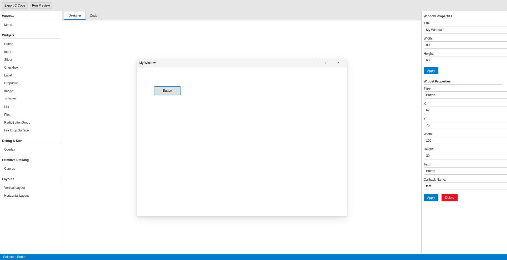
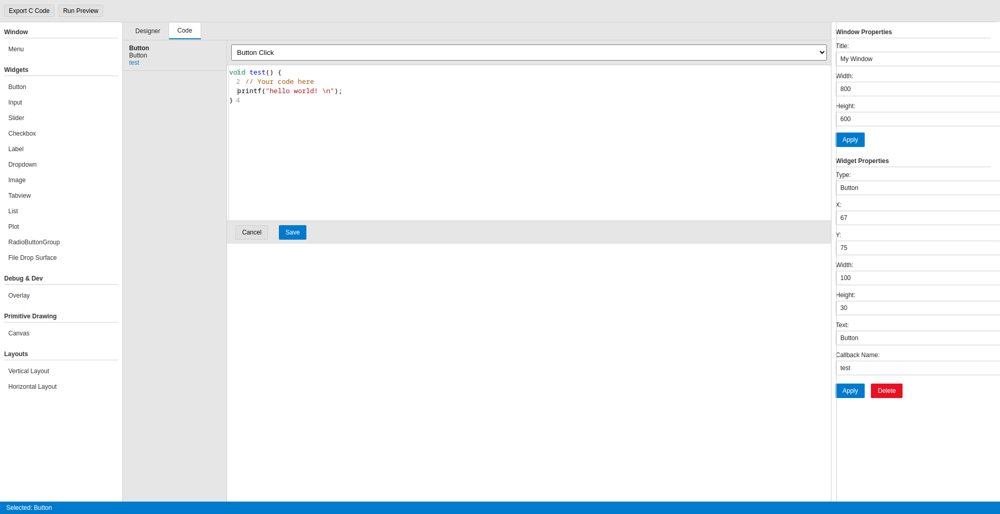

# Gooey Builder

An complete IDE for the Gooey GUI Toolkit.

## Features

- Drag-and-drop interface design
- Widget property editing
- Callback function editor
- C code generation & compilation
- Multiple widget types supported
- Layout management

## Widgets Available

- Basic: Button, Input, Slider, Checkbox, Label
- Containers: Vertical Layout, Horizontal Layout
- Advanced: Canvas, Image, Drop Surface

## License

MIT